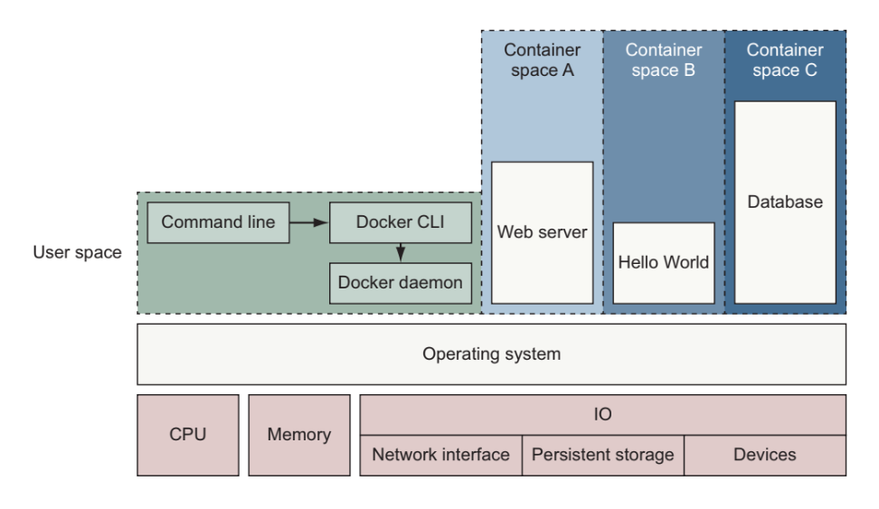

## Docker running three containter on a Linux system

Praise for the first edition

- All there is to know about Docker. Clear, complete, and precise.

- A compelling narrative for real-world Docker solutions. A must-read!

- An indispensable guide to understanding Docker and how it fits into your infrastruture.

- Will help you transition quickly to effective Docker use in complex real-world situations.

- a superlative introduction to, and reference for, the docker ecosystem.

# Contents
### 1. Welcome to Docker 
    #### 1.1 What is Docker?
    #### 1.2 What problems does Docker solve?
    #### 1.3 Why is Docker important?
    #### 1.4 Where and when to use Docker
    #### 1.5 Docker in the larger ecosystem
    #### 1.6 Getting help with the Docker command line

## PART 1: PROCESS ISOLATION AND ENVIRONMENT-INDEPENDENT COMPUTING
### 2. Running software in containers
### 3. Software installation simplified
### 4. Working with storage and volumes
### 5. Single-host networking
### 6 Limiting risk with resource controls

## PART 2: PACKAGING SOFTWARE FOR DISTRIBUTION
### 7. Packaging software in images
### 8. Building images automatically with Dockerfiles
### 9. Public and private software distribution
### 10. Image pipelines

## PART 3: 3HIGHER-LEVEL ABSTRACTIONS AND ORCHESTRATION

### 11. Services with Docker and Compose
### 12. First-class configuration abstractions
### 13. Orchestrating services on a cluster of Docker hosts with swarm

# Foreword - read done

# Preface

